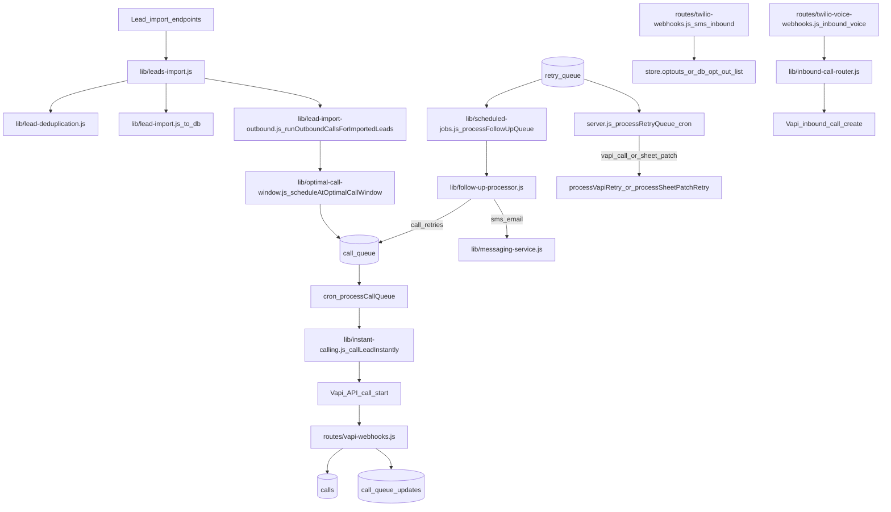

# Audit summary (in-depth)

This document is the **system map + high-risk surface inventory** used to drive the deeper reliability/security/performance audits and the PR-ready remediation plans.

## System map (critical flows)

## Key entrypoints (where behavior “really happens”)

- **Import → enqueue**: `routes/import-leads.js` → `lib/leads-import.js` → `lib/lead-import-outbound.js#runOutboundCallsForImportedLeads`\n
  - Scheduling: `lib/optimal-call-window.js#scheduleAtOptimalCallWindow`\n
  - Queue insert: `db.js#addToCallQueue`
- **Dial execution**: `lib/instant-calling.js#callLeadInstantly` (Vapi call start + concurrency/wallet gates)\n
  - Queue processing is orchestrated by server/cron (see `lib/scheduled-jobs.js` and legacy worker sites in `server.js`).
- **Vapi webhook state transitions**: `routes/vapi-webhooks.js` (signature verification + idempotency + post-call side effects)
- **Twilio webhooks**:\n
  - SMS inbound: `routes/twilio-webhooks.js` (DNC/STOP)\n
  - Voice inbound: `routes/twilio-voice-webhooks.js` (signature validation; routes inbound to Vapi)
- **Ops visibility**: `routes/ops.js#/api/ops/intent-status` → `lib/ops-invariants.js` (runtime “doing what we want” checks)

## High-risk surfaces (audit focus)

These are the areas most likely to contain **billing-affecting regressions**, **tenant/security bugs**, or **reliability issues**.

- **Dial spend control**\n
  - Concurrency, wallet gating, call cutoffs, and “no direct Vapi outside worker” constraints.\n
  - Primary modules: `lib/instant-calling.js`, `lib/follow-up-processor.js`, `scripts/check-policy.mjs`, `tests/canaries/*`.
- **Scheduling correctness**\n
  - Any bug that returns a past `scheduled_for` turns into burst dialing.\n
  - Primary modules: `lib/optimal-call-window.js`, enqueue call sites (imports/recalls/retries).
- **Retry correctness**\n
  - Due-now backlog, “stuck processing” rows, and requeue loops.\n
  - Primary modules: retry processors (legacy `server.js#processRetryQueue`, follow-up processor, webhook retry), `lib/ops-invariants.js`.
- **Webhook correctness & safety**\n
  - Signature verification, idempotency, and multi-instance behavior.\n
  - Primary modules: `routes/vapi-webhooks.js`, `routes/twilio-voice-webhooks.js`, `middleware/vapi-webhook-verification.js`.
- **Tenant isolation / leakage**\n
  - Ensure internal tenant slugs never escape into payloads/copy.\n
  - Primary modules: route response bodies, Vapi payload builders, transcript handling, dashboard surfaces; policy gates in `scripts/check-policy.mjs`.

## Existing enforcement that constrains the audit

- **Behavioral intent contract**: `docs/INTENT.md`\n
- **Static policy gates**: `scripts/check-policy.mjs` (run via `npm run check:policy`)\n
- **Synthetic canaries**: `tests/canaries/*.canary.test.js`\n
- **Runtime invariants**: `lib/ops-invariants.js` surfaced via `GET /api/ops/intent-status` (`routes/ops.js`)\n
- **CI harness**: `scripts/run-test-ci.mjs` (order: policy → inventories → unit/integration-lite → coverage → leak detection)

