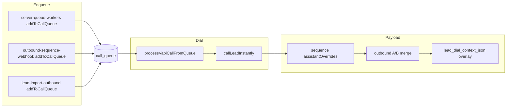

# PR4 + dashboard execution spec (pre-code)

**Design of record (narrative + locks):** [`.cursor/plans/tom_multi_stage_outbound_9c4e2b1a.plan.md`](../../.cursor/plans/tom_multi_stage_outbound_9c4e2b1a.plan.md) — Product alignment **A–L**, Part **III**, **III.13–III.15**.  
**This file:** executable checklist, file touch map, INTENT/policy/canary matrix, API shapes, verification, rollback. **Amend here only** if implementation discovers a material gap (append **Amendments**).

---

## Context

- **Shipped:** PR1–3 multi-stage sequence engine (`lead_sequence_state`, `outbound_sequence_json`, webhook advancement, dial merge, dashboard sequence panel, kill switch, gates). Tom tenant can be sequence-enabled per seed.
- **Not shipped:** Per-lead `leads.lead_dial_context_json`, final `variableValues` overlay after A/B, `_importContext` on sequence handoffs, queue **`outboundDialMode`** snapshot, tenant **`classicFollowUpCutoverDate`**, unified CRM filters, admin stop/dismiss + `qual._opsAudit`.
- **Constraints:** [Behavioral gates](../../.cursor/rules/behavioral-gates.mdc) — any change to dialing, queueing, handoff, tenant payloads → **INTENT** row + **policy and/or canary and/or invariant** in the **same PR**; `npm run test:ci` green before merge; **no** new `fetch('https://api.vapi.ai/call', …)` outside allow-listed modules.
- **Gate:** Do not merge PR4 to `main` until **`pr3_synthetic_run`** + **`pr3_acceptance`** (staging bar) per Tom plan frontmatter `pr4_gate_after_pr3_staging`.

---

## Definition of done

1. **Schema:** `leads.lead_dial_context_json` exists (Postgres **JSONB** nullable; SQLite **TEXT** JSON nullable); migrations idempotent; `mapRow` / lead reads used by queue worker include column when present.
2. **Dial path:** `processVapiCallFromQueue` SELECT extended; normalized JSON merged into Vapi payload as **`variableValues` only**, **after** sequence `buildAssistantOverridesForStage` merge **and** after A/B `mergeAssistantOverrides` (explicit final overlay per Part III.3 — do not rely on late whole-object `mergeAssistantOverrides` for lead CRM).
3. **Normalizer:** `lib/lead-dial-context.js` (name per repo convention): strip unknown top-level keys; enforce **`LEAD_DIAL_CONTEXT_MAX_BYTES`** (default **8192**, floor **4096**); strip **reserved** keys (const + unit tests); never pass internal `client_key` into customer-visible merged values.
4. **Queue snapshot:** Every **new** `vapi_call` enqueue sets `call_data.outboundDialMode` **`"classic"`** | **`"sequence"`**; **`null`** legacy rows infer: sequence iff `call_data.stageId` set. Dial + webhook advancement respect **`outboundDialMode`** over live tenant flip when set. **Note:** `addToCallQueue` **dedupes** pending rows — when updating an existing row’s `scheduled_for`/`priority`, ensure **`outboundDialMode`** is not silently dropped or wrongly flipped (document rule: set on insert; on merge-update preserve stricter mode or re-stamp from enqueue helper — **pick one rule in code + canary**).
5. **Tenant JSON:** `validateOutboundSequenceConfig` accepts optional root **`handoffImportContextKeys`** (string[]), **`classicFollowUpCutoverDate`** (`YYYY-MM-DD`), invalid date → config errors / tenant fallback consistent with existing malformed JSON posture.
6. **Handoffs:** On `vapi_webhook.sequence_completed` and `vapi_webhook.sequence_abandoned`, set **`qual._importContext`** from allow-list (tenant keys or code default **`crmCampaign`**, **`laneHint`** in order). Never embed full lead JSON.
7. **INTENT + policy + canaries:** New `intentId`(s) for lead context merge, dial-mode freeze, `_importContext` bounds, no tenant-key leak in merged vars; `scripts/check-policy.mjs` allowlist for writers to `lead_dial_context_json`; canary `tests/canaries/lead-outbound-context-merge.canary.test.js` (or split if large).
8. **Dashboard (PR4 UX track):** Unified filter bar query contract shared by follow-up list + `#outboundSequenceWindow`; tab predicates match **Product alignment I** and **`source`** literals in [`lib/vapi-webhooks/outbound-sequence-webhook.js`](../../lib/vapi-webhooks/outbound-sequence-webhook.js).
9. **PR4.5 (may follow PR4 merge or same PR if scope agreed):** Admin-only **POST** stop-sequence + dismiss-salvage; **`qual._opsAudit`** append (max **32** FIFO); **`qual._salvageDismissedAt`** / by; INTENT rows for authz + no double-dial after stop.
10. **CI:** `npm run test:ci` green.

---

## Non-goals (this execution pass)

- Per-lead **L2** message overrides (`firstMessage` / `systemMessage`) — **PR5** / `pr5_lead_l2_message_overrides`.
- Historical **backfill** of old leads into mid-sequence; **per-stage voicemail** audio.
- Dedicated **`audit_log`** SQL table (v1 uses **`qual._opsAudit`** only).
- **Import burst mode**, review-queue before dial, hourly enrollment cap (**Product alignment K**).
- Second Vapi assistant per lead; any new direct Vapi POST site.

---

## Preconditions (before first PR4 commit to `main`)

| Step | Owner | Done when |
|------|--------|-----------|
| Staging synthetic | Ops / eng | Tom tenant: lead → stage 1 → … → handoff; kill switch toggled on staging |
| `pr3_synthetic_run` + `pr3_acceptance` | Eng | YAML todos completed; evidence logged (screenshots / SQL snippets acceptable) |
| Rollback read | Eng | [`docs/SEQUENCE_ROLLBACK.md`](../../docs/SEQUENCE_ROLLBACK.md) re-read; PR4 rollback section appended (see below) |

---

## Architecture (data flow)



---

## Work breakdown (checklist)

### A. Schema + DB mapping

- [ ] **Postgres** [`db/migrations/postgres-core-schema.js`](../../db/migrations/postgres-core-schema.js): `ALTER TABLE leads ADD COLUMN IF NOT EXISTS lead_dial_context_json JSONB;` (or equivalent DO block pattern used elsewhere).
- [ ] **SQLite** [`db/migrations/sqlite-core-schema.js`](../../db/migrations/sqlite-core-schema.js): `ALTER TABLE leads ADD COLUMN lead_dial_context_json TEXT;` (SQLite additive migration style per file conventions).
- [ ] **Domain / insert paths:** grep `INTO leads` / `UPDATE leads` — extend allowlist in **`scripts/check-policy.mjs`** for `lead_dial_context_json` writes (only migrations + explicit domain + tests + docs/INTENT if cited).
- [ ] **`db.js`** (or lead domain): ensure any helper that maps lead rows for API exposes `leadDialContext` / raw JSON consistently.

### B. Queue worker lead read

- [ ] [`lib/server-queue-workers.js`](../../lib/server-queue-workers.js) `processVapiCallFromQueue`: extend SELECT from  
  `id, name, phone, service, source, notes, status, created_at`  
  to include **`lead_dial_context_json`** (alias optional).
- [ ] Parse JSON defensively (null, `{}`, invalid → treat as empty); pass parsed object on `leadForCall` or separate arg into `callLeadInstantly` (match existing `callLeadInstantly` signature patterns).

### C. Normalizer module

- [ ] New **`lib/lead-dial-context.js`**:  
  - `RESERVED_LEAD_CONTEXT_KEYS` exported const (single source of truth; unit tests lock set).  
  - `normalizeLeadDialContext(raw, { maxBytes })` → `{ variableValues: Record<string,string> }` or empty.  
  - Strip non-scalars; strip reserved; size check **after** stringify candidate or measure bytes UTF-8.  
  - Document collision rule with sequence engine keys (**Part III.9**): engine wins on reserved names.

### D. `callLeadInstantly` merge (critical order)

- [ ] [`lib/instant-calling.js`](../../lib/instant-calling.js): after existing sequence merge and A/B merge, **apply** normalized lead `variableValues` as **final** shallow merge into `payload.assistantOverrides.variableValues` (only keys from normalizer output).  
- [ ] Add short comment citing **Part III.3** + link to `mergeAssistantOverrides` behavior in [`lib/outbound-ab-variant.js`](../../lib/outbound-ab-variant.js).  
- [ ] **`outboundDialMode`:** when building dial, resolve effective mode: `queueCallData.outboundDialMode` if set; else infer from `stageId`; else tenant live config — use for **guarding** sequence merge (do not attach sequence overrides if effective mode is classic).

### E. Enqueue sites — `outboundDialMode`

Stamp **`call_data.outboundDialMode`** at every **`addToCallQueue`** for `callType === 'vapi_call'` that represents outbound dial intent:

| File | Responsibility |
|------|----------------|
| [`lib/server-queue-workers.js`](../../lib/server-queue-workers.js) | `queueNewLeadsForCalling` / initial lead queue: `"sequence"` when tenant sequence enabled + state created + `stageId` set; else `"classic"`. |
| [`lib/vapi-webhooks/outbound-sequence-webhook.js`](../../lib/vapi-webhooks/outbound-sequence-webhook.js) | `sequence_next` rows: always `"sequence"`. |
| [`lib/lead-import-outbound.js`](../../lib/lead-import-outbound.js) | Import-driven enqueues: match same rule as queuer for that tenant. |
| [`lib/follow-up-processor.js`](../../lib/follow-up-processor.js) | Retries / follow-up recall path: classic unless row explicitly carries sequence metadata (document per call site). |
| [`routes/import-leads.js`](../../routes/import-leads.js) / [`lib/leads-import.js`](../../lib/leads-import.js) | Any direct enqueue — audited in same PR. |

- [ ] **Dedupe merge path** in [`db/domains/call-queue.js`](../../db/domains/call-queue.js): when updating existing pending row, define rule for `outboundDialMode` + document in canary.

### F. Webhook — `_importContext`

- [ ] [`lib/vapi-webhooks/outbound-sequence-webhook.js`](../../lib/vapi-webhooks/outbound-sequence-webhook.js) (or helper imported there): build `_importContext` from `lead_dial_context_json.variableValues` ∩ allow-list (**tenant `handoffImportContextKeys`** or default **`['crmCampaign','laneHint']`**).  
- [ ] Attach only on **`sequence_completed`** / **`sequence_abandoned`** upserts (same `source` strings already in file).  
- [ ] Bounded object size (reuse normalizer cap or smaller for `_importContext` only).

### G. `validateOutboundSequenceConfig`

- [ ] [`lib/outbound-sequence.js`](../../lib/outbound-sequence.js): optional `handoffImportContextKeys` (array of non-empty strings); optional `classicFollowUpCutoverDate` (strict `YYYY-MM-DD`); errors appended to `errors` array when `enabled: true` (and validate shape when `enabled: false` if we still persist JSON for dashboard — **per Product alignment I**).

### H. INTENT.md

Add rows (IDs illustrative — finalize stable ids in PR):

| Proposed `intentId` | Statement (summary) |
|---------------------|---------------------|
| `lead-dial-context.merge-order` | Lead CRM `variableValues` overlay runs **after** A/B and after sequence template merge; reserved keys stripped. |
| `lead-dial-context.no-tenant-key-in-payload` | Merged Vapi `variableValues` must not contain internal tenant keys. |
| `queue.outbound-dial-mode-freeze` | When `call_data.outboundDialMode` set, dial path respects it over live tenant sequence toggle; null uses infer rule. |
| `handoff.import-context-bounded` | `_importContext` only allow-listed keys; bounded size; never full raw lead JSON. |
| `ops.stop-sequence-admin-only` | (PR4.5) Stop/dismiss endpoints require tenant admin; append `_opsAudit`. |

Each row: **Constrains**, **Enforced by**, **Manual disprove** filled before merge.

### I. Policy (`scripts/check-policy.mjs`)

- [ ] Allowlist **writes** to `lead_dial_context_json` (migrations, domain file(s), tests).  
- [ ] Forbid raw `client_key` in new customer-visible string builders if policy already has patterns — extend only if needed.

### J. Canaries (`tests/canaries/`)

| Canary file (proposed) | Asserts |
|------------------------|---------|
| `lead-outbound-context-merge.canary.test.js` | With fixture tenant + lead JSON, merged `variableValues` contains CRM key; reserved stripped; order vs A/B mock. |
| `queue-outbound-dial-mode-freeze.canary.test.js` | Tenant live “sequence” off but `outboundDialMode: sequence` + `stageId` still merges sequence (or inverse per lock — **must match III.15**). |
| Extend existing `sequence-respects-tenant-flag` or new | Flip `outboundDialMode` classic blocks sequence overrides when `stageId` absent. |

### K. Dashboard + APIs (PR4 UX)

- [ ] [`public/client-dashboard.html`](../../public/client-dashboard.html): unified filter state (query param or in-memory first; persist in `localStorage` optional v1.1).  
- [ ] **Handoff / follow-up JSON:** [`routes/lead-handoff.js`](../../routes/lead-handoff.js) — extend list/export SELECTs if needed so `qual._importContext`, `_opsAudit`, `_salvageDismissedAt` round-trip; keep CSV column policy from Part III.10.  
- [ ] **Follow-up queue API:** [`routes/follow-up-queue.js`](../../routes/follow-up-queue.js) — if the dashboard table is backed here, add same `filter` / `tab` query params **or** introduce a thin shared `lib/follow-up-filters.js` used by both this router and sequence visibility (preferred to avoid drift).  
- [ ] [`routes/outbound-sequence-visibility-mount.js`](../../routes/outbound-sequence-visibility-mount.js): accept same `filter=` / `tab=` query; **server-side filter** predicates:  
  - **Classic:** `created_at` &lt; cutover (tenant TZ) **or** (no cutover ∧ no sequence artifact).  
  - **Sequence:** `created_at` ≥ cutover (if cutover set) ∧ (active sequence **or** `source === sequence_completed`); **exclude** `sequence_abandoned`.  
  - **Abandoned·salvage:** `source === sequence_abandoned`; exclude dismissed default.  
  - **All:** union.  
- [ ] Copy strings for salvage (“machine stopped — human next”) per **Product alignment F**.

### L. PR4.5 — Stop + dismiss (admin)

- [ ] New routes e.g. `POST /api/client/.../sequence/stop` + `POST .../salvage/dismiss` (exact paths follow existing client dashboard auth patterns — grep `client-dashboard` X-API-Key / session handlers).  
- [ ] **Authz:** tenant **admin/owner** only (**Product alignment L**).  
- [ ] **Stop:** cancel pending/processing `call_queue` for phone; clear `retry_queue` rows if applicable; set `lead_sequence_state.status` terminal; **no** new enqueue; append `_opsAudit`.  
- [ ] **Dismiss:** set `qual._salvageDismissedAt` (+ `_salvageDismissedBy`); append `_opsAudit`; filtered list hides by default.  
- [ ] INTENT + canary: after stop, next worker tick does not dial same phone.

### M. Docs + rollback snippet

- [ ] Append **PR4 rollback** to [`docs/SEQUENCE_ROLLBACK.md`](../../docs/SEQUENCE_ROLLBACK.md): `lead_dial_context_json` nullable safe; feature flags env if any; SQL to clear bad JSON.  
- [ ] Operator runbook one-pager: import ramp (**K**), cutover date meaning (**I**).

---

## Optional import population (`pr4_import_api_optional`)

- [ ] If CSV column mapping exists → populate `lead_dial_context_json` on insert.  
- [ ] Else document **`UPDATE leads SET lead_dial_context_json = $json::jsonb WHERE id = …`** for ops (Postgres + SQLite variants).

---

## Verification commands

```bash
npm run test:ci
```

Manual (staging):

1. Sequence handoff row shows `_importContext` keys only from allow-list.  
2. Flip tenant sequence off; pending row with `outboundDialMode: sequence` still gets sequence dial once; new enqueues classic.  
3. Admin stop → no further `call_queue` rows for phone; audit visible.  
4. Filter tabs counts sanity vs SQL.

---

## Risk and rollback

| Risk | Mitigation | Rollback |
|------|------------|----------|
| Wrong merge order breaks prompts | Golden snapshot test + canary | Revert PR; column stays null |
| `outboundDialMode` + dedupe loses stamp | Dedicated canary for merge-update | Hotfix `call-queue.js` |
| `_importContext` PII leak | Minimal default keys + tenant opt-in | Tenant JSON list shrink |
| Dashboard filter wrong cohort | Server-side filter + SQL cross-check | Disable filter UI; show All |

---

## Amendments

| Date | Note |
|------|------|
| 2026-05-11 | Initial spec from Tom plan Part III + Product alignment A–L + III.15. |
